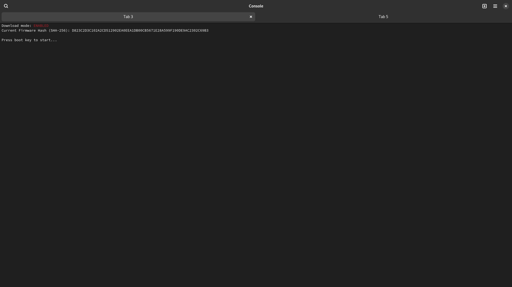
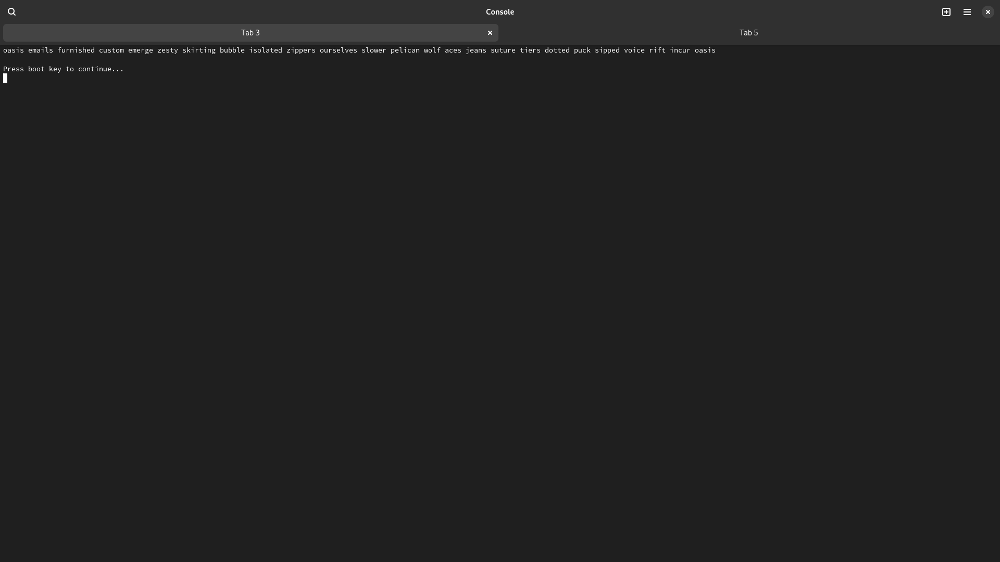
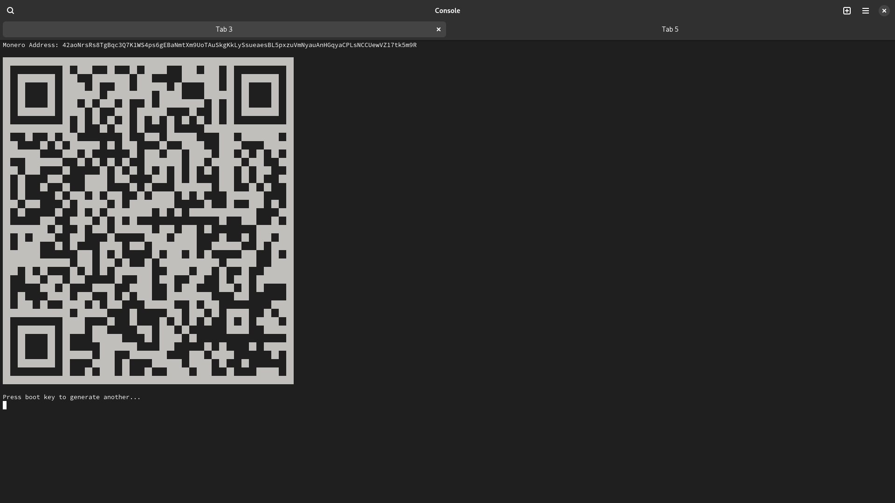

# Monero Wallet Generator for ESP32-C3

Just build, and flash with PlatformIO and open a serial connection.

Images:

https://emn178.github.io/online-tools/keccak_256.html
https://www.getmonero.org/library/MoneroAddressesCheatsheet20201206.pdf
https://gitlab.demlabs.net/cellframe/cellframe-sdk/-/blob/c83fbc812966aaf675c3f499c19c21dd888ea94d/3rdparty/monero_crypto/crypto_ops_builder/crypto-ops-old.c
https://github.com/rohanrhu/MoneroSharp/blob/master/MoneroSharp/MoneroSharp/MoneroAccount.cs
https://xmr.llcoins.net/addresstests.html
https://appdevtools.com/base58-encoder-decoder
https://github.com/monero-ecosystem/monero-python/tree/master/monero

my firmware hash:
D823C2D3C102A2CD512902EA0EEA1DB00CB5671E28A599F190DE9AC2302C69B3

old
AD413BC4870FAA39D8259610612C279AB356C610F80FAAAC519C7959ED374980
8B8AAAC4C992D4339C964256DC7884EC2C2BD33347069863B32773C267FC6697

## warning, this locks esp32c3 forever!

pip install espotool
espefuse.py --chip esp32c3 --port /dev/ttyACM28 burn_efuse DIS_DOWNLOAD_MODE

## TODO: (dont run this) lock completly over USB UART connnector

espefuse.py --chip esp32c3 --port /dev/? burn_efuse ABS_DONE_0

espefuse.py --chip esp32c3 --port /dev/? burn_efuse ABS_DONE_1

espefuse.py --chip esp32c3 --port /dev/? burn_efuse BLOCK_WR_DIS
